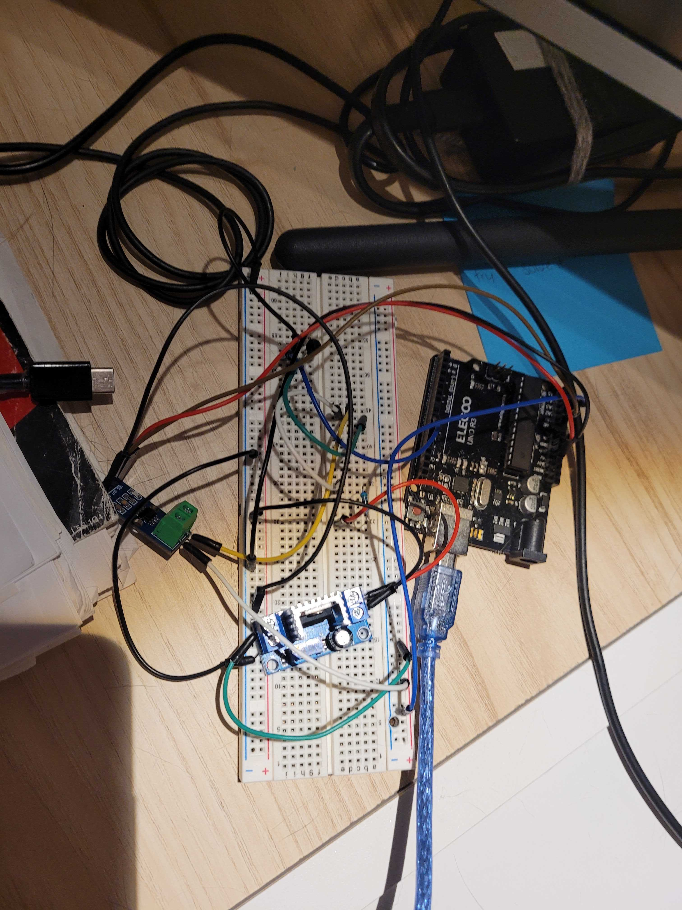
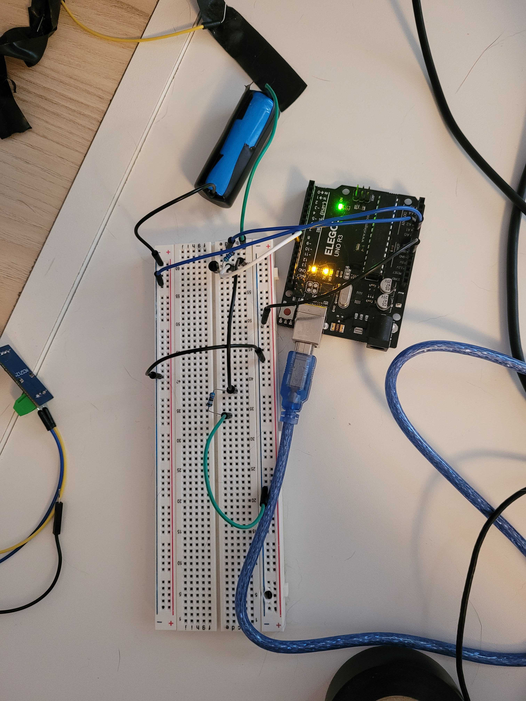

# 🔋Estimating battery SOC with an Extended Kalman Filter and an Arduino 
I made an extended kalman filter (EKF) to estimate battery SOC (state of charge). An accurate estimation for SOC can help avoid battery degradation, and make the battery last longer!!

If you want an overview, check out my video :) https://www.youtube.com/watch?v=EO3NNHc-09Y&t=241s

An EKF is the same algorithm your phone uses to tell you that it's 60% charged. It combines a physics based model with a machine learning model to return the most accurate estimation for SOC. In order to build this, I first needed to create equations that represent the physics based model, because that is different for each battery. 

## Creating the physics-based model
The first thing I did was discharge the battery from 100% to 0% SOC at constant, low, current. This allowed me to create an OCV-SOC curve, which relates open circuit voltage (voltage across battery terminals when it's not connected to a load) to state of charge. Check out the file that has the arduino code to do this yourself, and here's a picture of the Arduino circuit I used. 

  >

OCV is different than terminal voltage, and terminal voltage is what you can actually measure. So I needed to relate OCV to terminal voltage. And to do that, I used a Thevenin equivalent circuit model (ECM). This is a simplified representation of a battery. To determine the values for R1, R2, and C1, I needed to do a pulse discharge test on the battery, which looked like this. Check out the rest of the repo for the code. And here's the circuit picture, + a circuit diagram for both circuits :) 

  

  

Now, I have an equation that relates terminal voltage (which is measureable) to OCV, and one that relates OCV to state of charge. This means that I can use terminal voltage to predict SOC!

## The algorithm
The power of an EKF though is that it doesn't just rely on one model, it uses past error to update it's prediction. So now, the EKF is going to make a prediction based on what it knows about the battery (the discharge current, the battery efficiency, etc. This is the f function in the code). It will then compare the predicted SOC value (from the  f function) to the "measured" SOC value, which was calculated using the equations from the physics based model and an actual voltage measurement. 

Based on past iterations, the EKF will determine which one of these sources has been most accurate in the past. This lets it compute the kalman gain, which assigns a weighting to each value. Then, the most accurate estimation for SOC is returned!!

If you want a deeper explination of the math (in addition to the theory), feel free to check out my article :) https://medium.com/@sasha_przybylski/the-math-behind-extended-kalman-filtering-0df981a87453

Have fun! This algorithm is pretty cool 🚀
